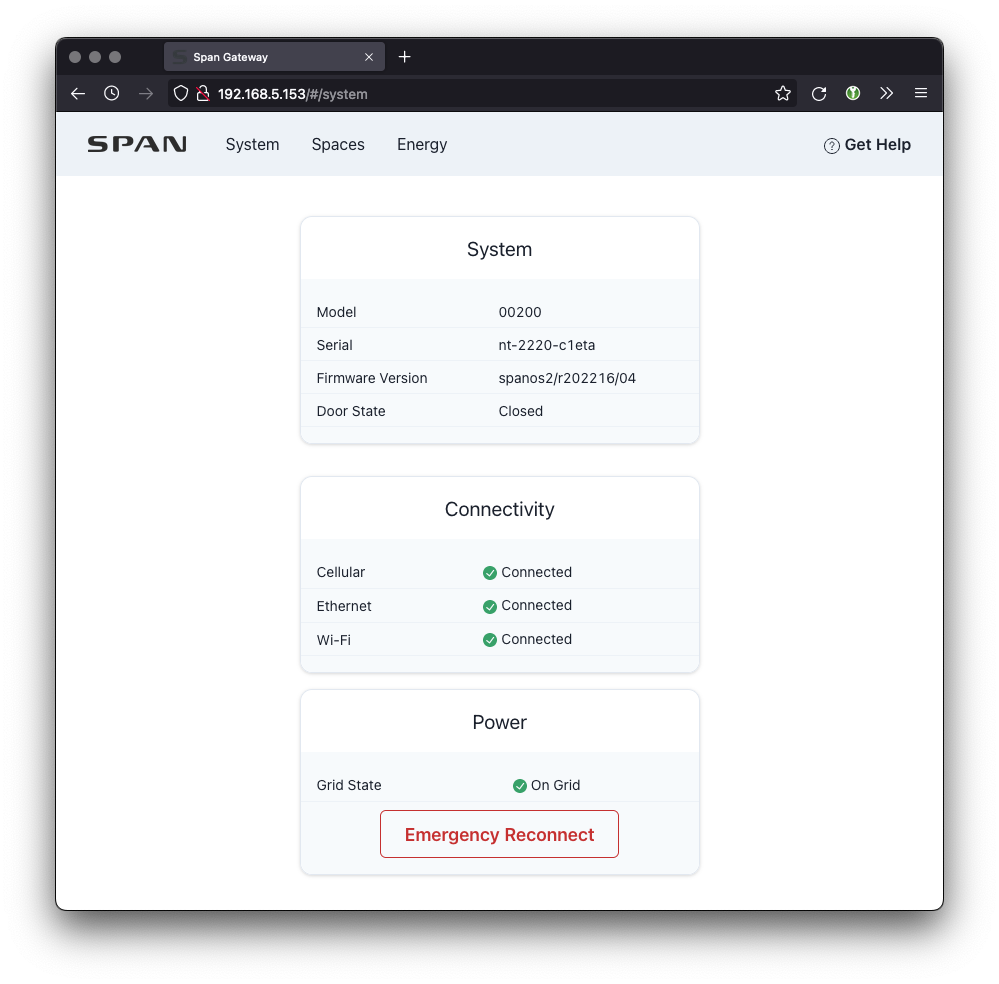
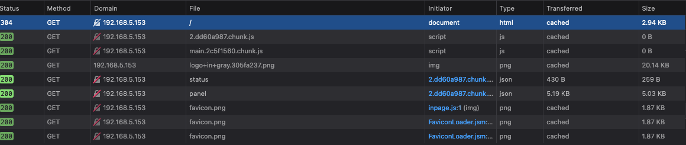
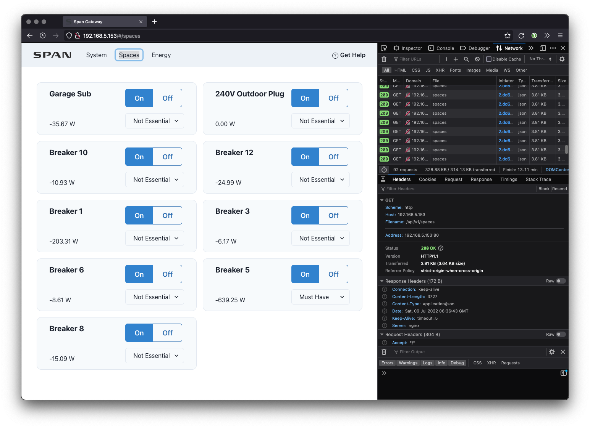
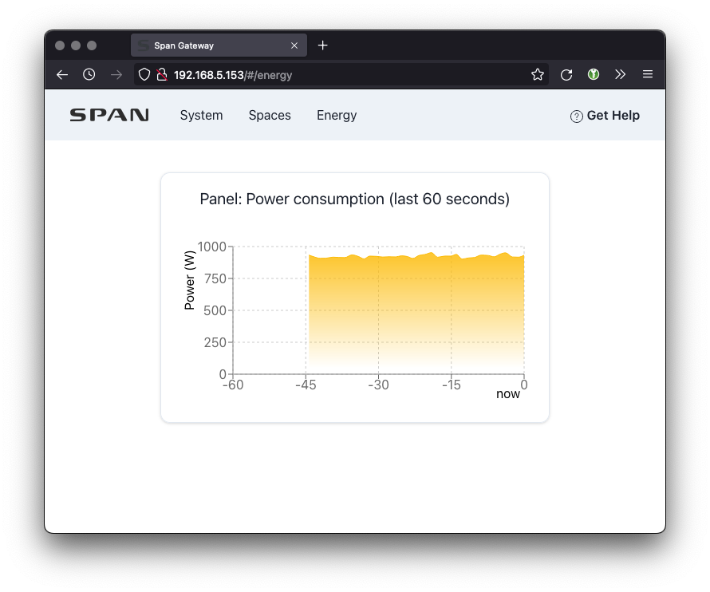

# Research

## Network Connections

The panel is connected to my network via both ethernet and WiFi. The hostname for each of the connection is `span-gateway`.

The wired connection has a MAC address from a range owned by Boundary Devices(`00:19:b8`).

The wireless connection has a MAC address from a range owned by Universal Global Scientific Industrial Cp(`08:03A:88`).

## `nmap` scan

```
sudo nmap -p- 192.168.5.152 192.168.5.153
Starting Nmap 7.92 ( https://nmap.org ) at 2022-07-08 23:14 PDT
Nmap scan report for span-gateway.home.norell.co (192.168.5.152)
Host is up (0.0017s latency).
Not shown: 65526 closed tcp ports (reset)
PORT      STATE SERVICE
22/tcp    open  ssh
80/tcp    open  http
111/tcp   open  rpcbind
5355/tcp  open  llmnr
5599/tcp  open  esinstall
6040/tcp  open  x11
8000/tcp  open  http-alt
8080/tcp  open  http-proxy
19240/tcp open  unknown
MAC Address: 00:19:B8:09:FA:C6 (Boundary Devices)

Nmap scan report for 192.168.5.153
Host is up (0.00098s latency).
Not shown: 65526 closed tcp ports (reset)
PORT      STATE SERVICE
22/tcp    open  ssh
80/tcp    open  http
111/tcp   open  rpcbind
5355/tcp  open  llmnr
5599/tcp  open  esinstall
6040/tcp  open  x11
8000/tcp  open  http-alt
8080/tcp  open  http-proxy
19240/tcp open  unknown
MAC Address: 00:19:B8:09:FA:C6 (Boundary Devices)

Nmap done: 2 IP addresses (2 hosts up) scanned in 73.63 seconds
```

## Checking out the HTTP (80/tcp) page



Looks like a nice status page. Checking out the network interactions with the page.



It pulls information in from `/api/v1/panel` and `/api/v1/status`

## Status API endpoint

```json
{
  "software": {
    "firmwareVersion": "spanos2/r202216/04",
    "updateStatus": "idle",
    "env": "prod"
  },
  "system": {
    "manufacturer": "Span",
    "serial": "nt-2220-c1eta",
    "model": "00200",
    "doorState": "CLOSED",
    "uptime": 102552
  },
  "network": {
    "eth0Link": true,
    "wlanLink": true,
    "wwanLink": true
  }
}
```

### Panel API endpoint

```json
{
  "mainRelayState": "CLOSED",
  "instantGridPowerW": 945.986572265625,
  "feedthroughPowerW": 26.210487691685557,
  "gridSampleStartMs": 3725158,
  "gridSampleEndMs": 3725183,
  "dsmGridState": "DSM_GRID_UP",
  "dsmState": "DSM_ON_GRID",
  "currentRunConfig": "PANEL_ON_GRID",
  "branches": [
    {
      "id": 1,
      "relayState": "CLOSED",
      "instantPowerW": -195.30067443847656,
      "importedActiveEnergyWh": 0,
      "exportedActiveEnergyWh": 5640.60302734375
    },
    {
      "id": 2,
      "relayState": "CLOSED",
      "instantPowerW": 0.6881495118141174,
      "importedActiveEnergyWh": 51.552459716796875,
      "exportedActiveEnergyWh": 64.70247650146484
    },
    {
      "id": 3,
      "relayState": "CLOSED",
      "instantPowerW": -7.782997131347656,
      "importedActiveEnergyWh": 0.00005112825965625234,
      "exportedActiveEnergyWh": 366.7633361816406
    },
    {
      "id": 4,
      "relayState": "CLOSED",
      "instantPowerW": 0.8980045318603516,
      "importedActiveEnergyWh": 2.2763192653656006,
      "exportedActiveEnergyWh": 4.977299690246582
    },
    {
      "id": 5,
      "relayState": "CLOSED",
      "instantPowerW": -627.4848022460938,
      "importedActiveEnergyWh": 0,
      "exportedActiveEnergyWh": 27018.662109375
    },
    {
      "id": 6,
      "relayState": "CLOSED",
      "instantPowerW": -8.34873104095459,
      "importedActiveEnergyWh": 86.37287902832031,
      "exportedActiveEnergyWh": 621.48583984375
    },
    {
      "id": 7,
      "relayState": "CLOSED",
      "instantPowerW": -32.91138458251953,
      "importedActiveEnergyWh": 0.67339688539505,
      "exportedActiveEnergyWh": 1043.3663330078125
    },
    {
      "id": 8,
      "relayState": "CLOSED",
      "instantPowerW": -14.275386810302734,
      "importedActiveEnergyWh": 0,
      "exportedActiveEnergyWh": 1024.106201171875
    },
    {
      "id": 9,
      "relayState": "CLOSED",
      "instantPowerW": -2.1107914447784424,
      "importedActiveEnergyWh": 0.0220043808221817,
      "exportedActiveEnergyWh": 55.630157470703125
    },
    {
      "id": 10,
      "relayState": "CLOSED",
      "instantPowerW": -11.792976379394531,
      "importedActiveEnergyWh": 292.207275390625,
      "exportedActiveEnergyWh": 778.1663818359375
    },
    {
      "id": 11,
      "relayState": "CLOSED",
      "instantPowerW": -0.3637486696243286,
      "importedActiveEnergyWh": 3.1268134117126465,
      "exportedActiveEnergyWh": 2.2415008544921875
    },
    {
      "id": 12,
      "relayState": "CLOSED",
      "instantPowerW": -24.361541748046875,
      "importedActiveEnergyWh": 1.0273759365081787,
      "exportedActiveEnergyWh": 2330.13330078125
    },
    {
      "id": 13,
      "relayState": "CLOSED",
      "instantPowerW": 0.786956250667572,
      "importedActiveEnergyWh": 3.919607162475586,
      "exportedActiveEnergyWh": 1.5969102382659912
    },
    {
      "id": 14,
      "relayState": "CLOSED",
      "instantPowerW": 0.5875939726829529,
      "importedActiveEnergyWh": 4.033290386199951,
      "exportedActiveEnergyWh": 5.706231594085693
    },
    {
      "id": 15,
      "relayState": "CLOSED",
      "instantPowerW": -0.4922848641872406,
      "importedActiveEnergyWh": 2.6251304149627686,
      "exportedActiveEnergyWh": 3.69538950920105
    },
    {
      "id": 16,
      "relayState": "CLOSED",
      "instantPowerW": 1.7015743255615234,
      "importedActiveEnergyWh": 3.3861632347106934,
      "exportedActiveEnergyWh": 1.5978946685791016
    },
    {
      "id": 17,
      "relayState": "CLOSED",
      "instantPowerW": 0.8682750463485718,
      "importedActiveEnergyWh": 4.449962139129639,
      "exportedActiveEnergyWh": 1.2791783809661865
    },
    {
      "id": 18,
      "relayState": "CLOSED",
      "instantPowerW": 1.0326614379882812,
      "importedActiveEnergyWh": 6.210230350494385,
      "exportedActiveEnergyWh": 2.8727996349334717
    },
    {
      "id": 19,
      "relayState": "CLOSED",
      "instantPowerW": 0.002623187378048897,
      "importedActiveEnergyWh": 2.4380788803100586,
      "exportedActiveEnergyWh": 4.084386825561523
    },
    {
      "id": 20,
      "relayState": "CLOSED",
      "instantPowerW": 0.2518259882926941,
      "importedActiveEnergyWh": 3.1940479278564453,
      "exportedActiveEnergyWh": 1.7771186828613281
    },
    {
      "id": 21,
      "relayState": "CLOSED",
      "instantPowerW": 0.06295649707317352,
      "importedActiveEnergyWh": 4.035600185394287,
      "exportedActiveEnergyWh": 1.3653596639633179
    },
    {
      "id": 22,
      "relayState": "CLOSED",
      "instantPowerW": 0.16963279247283936,
      "importedActiveEnergyWh": 6.308332443237305,
      "exportedActiveEnergyWh": 2.4966225624084473
    },
    {
      "id": 23,
      "relayState": "CLOSED",
      "instantPowerW": 0.13203376531600952,
      "importedActiveEnergyWh": 1.8779051303863525,
      "exportedActiveEnergyWh": 3.3613991737365723
    },
    {
      "id": 24,
      "relayState": "CLOSED",
      "instantPowerW": -0.9880672693252563,
      "importedActiveEnergyWh": 3.4148075580596924,
      "exportedActiveEnergyWh": 1.9213440418243408
    },
    {
      "id": 25,
      "relayState": "CLOSED",
      "instantPowerW": 0.02360868826508522,
      "importedActiveEnergyWh": 4.119348526000977,
      "exportedActiveEnergyWh": 1.8735814094543457
    },
    {
      "id": 26,
      "relayState": "CLOSED",
      "instantPowerW": 0.2850530445575714,
      "importedActiveEnergyWh": 5.266289710998535,
      "exportedActiveEnergyWh": 1.0615952014923096
    },
    {
      "id": 27,
      "relayState": "CLOSED",
      "instantPowerW": -0.22734291851520538,
      "importedActiveEnergyWh": 2.2877912521362305,
      "exportedActiveEnergyWh": 3.82810640335083
    },
    {
      "id": 28,
      "relayState": "CLOSED",
      "instantPowerW": -0.9198644161224365,
      "importedActiveEnergyWh": 3.6162397861480713,
      "exportedActiveEnergyWh": 1.7593104839324951
    },
    {
      "id": 29,
      "relayState": "CLOSED",
      "instantPowerW": -0.23958446085453033,
      "importedActiveEnergyWh": 2.934014320373535,
      "exportedActiveEnergyWh": 2.24984073638916
    },
    {
      "id": 30,
      "relayState": "CLOSED",
      "instantPowerW": 0.14427530765533447,
      "importedActiveEnergyWh": 2.87223744392395,
      "exportedActiveEnergyWh": 2.4006965160369873
    },
    {
      "id": 31,
      "relayState": "CLOSED",
      "instantPowerW": 0.06208210438489914,
      "importedActiveEnergyWh": 1.648521065711975,
      "exportedActiveEnergyWh": 4.009796142578125
    },
    {
      "id": 32,
      "relayState": "CLOSED",
      "instantPowerW": 0.12678739428520203,
      "importedActiveEnergyWh": 3.8238978385925293,
      "exportedActiveEnergyWh": 1.7251538038253784
    }
  ]
}
```

## Spaces Page

It looks like this gets refreshed every second using the `/api/v1/spaces` endpoint.



And the content is

```json
{
  "spaces": {
    "73ce327ab25b410684e4589371374ef4": {
      "id": "73ce327ab25b410684e4589371374ef4",
      "name": "Garage Sub",
      "relayState": "CLOSED",
      "instantPowerW": -37.16269898414612,
      "instantPowerUpdateTimeS": 1657348773,
      "importEnergyAccumWh": 0.6954012662172318,
      "exportEnergyAccumWh": 1105.7787322998047,
      "energyAccumUpdateTimeS": 1657348603,
      "tabs": [
        7,
        9
      ],
      "priority": "NOT_ESSENTIAL",
      "is_user_controllable": true,
      "is_sheddable": false,
      "is_never_backup": false
    },
    "c27f060bec34486d8295b5d67d061589": {
      "id": "c27f060bec34486d8295b5d67d061589",
      "name": "240V Outdoor Plug",
      "relayState": "CLOSED",
      "instantPowerW": 0,
      "instantPowerUpdateTimeS": 1657348773,
      "importEnergyAccumWh": 53.84614324569702,
      "exportEnergyAccumWh": 69.79449462890625,
      "energyAccumUpdateTimeS": 1657348603,
      "tabs": [
        2,
        4
      ],
      "priority": "NOT_ESSENTIAL",
      "is_user_controllable": true,
      "is_sheddable": false,
      "is_never_backup": false
    },
    "5ec7b8220d9a49338441a0e66949ca22": {
      "id": "5ec7b8220d9a49338441a0e66949ca22",
      "name": "Breaker 10",
      "relayState": "CLOSED",
      "instantPowerW": -11.549019813537598,
      "instantPowerUpdateTimeS": 1657348773,
      "importEnergyAccumWh": 292.207275390625,
      "exportEnergyAccumWh": 780.7797241210938,
      "energyAccumUpdateTimeS": 1657348603,
      "tabs": [
        10
      ],
      "priority": "NOT_ESSENTIAL",
      "is_user_controllable": true,
      "is_sheddable": false,
      "is_never_backup": false
    },
    "de0af907ee324dd39fc01e6f20474c1c": {
      "id": "de0af907ee324dd39fc01e6f20474c1c",
      "name": "Breaker 12",
      "relayState": "CLOSED",
      "instantPowerW": -25.071552276611328,
      "instantPowerUpdateTimeS": 1657348773,
      "importEnergyAccumWh": 1.0273759365081787,
      "exportEnergyAccumWh": 2335.009033203125,
      "energyAccumUpdateTimeS": 1657348603,
      "tabs": [
        12
      ],
      "priority": "NOT_ESSENTIAL",
      "is_user_controllable": true,
      "is_sheddable": false,
      "is_never_backup": false
    },
    "23e20a95ab1b4844ab1452cb266f10f5": {
      "id": "23e20a95ab1b4844ab1452cb266f10f5",
      "name": "Breaker 1",
      "relayState": "CLOSED",
      "instantPowerW": -182.5222625732422,
      "instantPowerUpdateTimeS": 1657348773,
      "importEnergyAccumWh": 0,
      "exportEnergyAccumWh": 5677.06201171875,
      "energyAccumUpdateTimeS": 1657348603,
      "tabs": [
        1
      ],
      "priority": "NOT_ESSENTIAL",
      "is_user_controllable": true,
      "is_sheddable": false,
      "is_never_backup": false
    },
    "ad19efa681b849748248ceb4638a39a1": {
      "id": "ad19efa681b849748248ceb4638a39a1",
      "name": "Breaker 3",
      "relayState": "CLOSED",
      "instantPowerW": -7.755890846252441,
      "instantPowerUpdateTimeS": 1657348773,
      "importEnergyAccumWh": 0.00005112825965625234,
      "exportEnergyAccumWh": 368.1944580078125,
      "energyAccumUpdateTimeS": 1657348603,
      "tabs": [
        3
      ],
      "priority": "NOT_ESSENTIAL",
      "is_user_controllable": true,
      "is_sheddable": false,
      "is_never_backup": false
    },
    "c775581976ea41ffb3d6d7137f05f8c6": {
      "id": "c775581976ea41ffb3d6d7137f05f8c6",
      "name": "Breaker 6",
      "relayState": "CLOSED",
      "instantPowerW": -8.111769676208496,
      "instantPowerUpdateTimeS": 1657348773,
      "importEnergyAccumWh": 86.37287902832031,
      "exportEnergyAccumWh": 623.0385131835938,
      "energyAccumUpdateTimeS": 1657348603,
      "tabs": [
        6
      ],
      "priority": "NOT_ESSENTIAL",
      "is_user_controllable": true,
      "is_sheddable": false,
      "is_never_backup": false
    },
    "3b34bd621ca4485ea33d8b77e4fe3702": {
      "id": "3b34bd621ca4485ea33d8b77e4fe3702",
      "name": "Breaker 5",
      "relayState": "CLOSED",
      "instantPowerW": -636.3677978515625,
      "instantPowerUpdateTimeS": 1657348773,
      "importEnergyAccumWh": 0,
      "exportEnergyAccumWh": 27140.966796875,
      "energyAccumUpdateTimeS": 1657348603,
      "tabs": [
        5
      ],
      "priority": "MUST_HAVE",
      "is_user_controllable": true,
      "is_sheddable": false,
      "is_never_backup": false
    },
    "a777e9170a884c83bcbd9077b654caf6": {
      "id": "a777e9170a884c83bcbd9077b654caf6",
      "name": "Breaker 8",
      "relayState": "CLOSED",
      "instantPowerW": -13.56887435913086,
      "instantPowerUpdateTimeS": 1657348773,
      "importEnergyAccumWh": 0,
      "exportEnergyAccumWh": 1026.8885498046875,
      "energyAccumUpdateTimeS": 1657348603,
      "tabs": [
        8
      ],
      "priority": "NOT_ESSENTIAL",
      "is_user_controllable": true,
      "is_sheddable": false,
      "is_never_backup": false
    }
  }
}
```

## Energy Page

And the visible page.



Which just polls `/api/v1/panel` and displays that information in a pretty graph.
